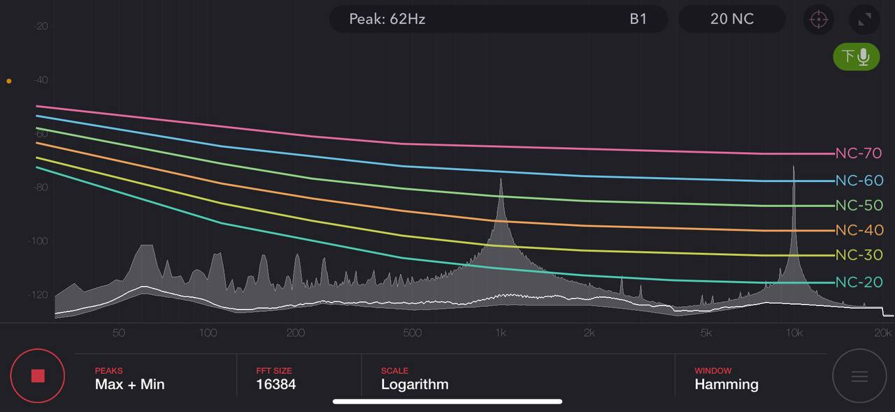

# CS120 Computer Network Report

In each project, we will explain our project part by part. Each part includes a brief explanation and the test method. At the end of each project, we will have an acknowledgement. You can build the code documentation by the following command:

```bash
cargo doc --open
```

[TOC]

## Project 1: Acoustic Link

We have mainly four components:

- Block buffer: The queue-like structure for stream data. Both original version and concurrent version are defined in
  [block_buffer.rs](./proj1_acoustic_link/src/block_buffer.rs).
- Sample I/O Stream: The structures operate on sample streams. Sample streams are divided into instream and outstream. Instreams read samples from physics world and store the data in its buffer. Ostreams fetch samples to its buffer and write them to the physics world. The sample streams are in [samples_stream.rs](./proj1_acoustic_link/src/sample_stream.rs).
- Physics packet sender/receiver: Structures send or receive packet. Sender owns an sample instream and receiver owns an sample outstream. They are responsible for packet detection, modulation and demodulation. The sender and receiver are in [phy_packet.rs](./proj1_acoustic_link/src/phy_packet.rs)
- Physics layer: The assembled physics layer. Provide basic data transmission over acoustic link. There three types of links: PSK, OFDM and PSK with error correction. The physics layers are in [phy_layer.rs](./proj1_acoustic_link/src/phy_layer.rs).

The whole project structure lies below:


### Part 1 Understand your tools

In this part, we implement

- `buffer` and `concurrent_buffer`: Basic block data structure. ([buffer.rs](./proj1_acoustic_link/src/block_buffer/buffer.rs), [concurrent_buffer.rs](./proj1_acoustic_link/src/block_buffer/concurrent_buffer.rs))
- `cpal_stream`: Audio I/O stream. ([cpal_stream.rs](./proj1_acoustic_link/src/sample_stream/cpal_stream.rs))
- `hound_stream`: wav file I/O stream. ([hound_stream.rs](./proj1_acoustic_link/src/sample_stream/hound_stream.rs))

We use `cpal_stream` to realize audio recording and playing. We use `hound_stream` to read audio files.

#### Tests

You can test part1 ck1 by the following command.

```bash
cargo test part1_ck1 --release -- --ignored
```

The program will start recording immediately for 10s.

---

You can test part1 ck2 by

```bash
cargo test part1_ck2 --release -- --ignored
```

The program will play a 10-second music clip while recording at the same time. After 10 seconds, it will replay the recorded sound.

### Part 2 Generating Correct Sound

We use previously defined structure: `cpal_stream` to write part2.

#### Tests

You can test part2 ck1 by

```bash
cargo test part2_ck1 --release -- --ignored
```

The program will play the signal
$$f(t) = \sin (2\pi \cdot 1000t) + \sin(2\pi\cdot 10000t)$$
You will get a spectrum similar to the picture:


### Part 3 Transmitting Your First Bit

In this part, we implement

- PSK modulation: `PSK` is an implementor of `Modem` which supoort `modulate` and `demodulate`.([psk.rs](./proj1_acoustic_link/src/phy_packet/modem/psk.rs))
- Correlation frame detection: `CorrelationFraming` is an implementor of `FrameDetector` which support `on_sample`.([frame_detect.rs](./proj1_acoustic_link/src/phy_packet/frame_detect.rs))
- Chirp signal as preamble: `ChirpUpDown` is an implementor of `PreambleGen`, which support `generate`, `len`, `norm` and other helper functions.([preambles.rs](./proj1_acoustic_link/src/phy_packet/preambles.rs))
- Packet sender and receiver: `PhySender` is an implementor of `PacketSender`, which support `send` function. `PhyReceiver` is an implementor of `PacketReceiver`, which suppor `recv` and `recv_timeout` functions.([txrx.rs](./proj1_acoustic_link/src/phy_packet/txrx.rs)).

#### Tests

**Note:** This test need two nodes to test. This test should be done in a quite room.

On sender node, run

```bash
cargo test part3_ck1_send --release -- --ignored
```

Sender will read input from `INPUT.txt`. (Under `./proj1_acoustic_link/INPUT.txt`). This file should contain 10000 numbers either 1 or 0.
You can generate input by the command

```bash
cd proj1_acoustic_link
./input_gen.py <seed> > INPUT.txt
```

`<seed>` can be an arbitrary number.

---

On the receiver node, run

```bash
cargo test part3_ck1_recv --release -- --ignored
```

Receiver will write the received bits into `OUTPUT.txt`. (Under `./proj1_acoustic_link/OUTPUT.txt`.
Receiver will timeout after 1s if it didn't get any packets.
You can use

```bash
cd proj1_acoustic_link
./cmp.py | wc -l
```

to get all the error bits. It should be less than 100.

### Part 4

In this part, we implemented file transmission with error correction.

- In `phy_layer` module, we added `AtomicPHY` which use sequence number and CRC checksum
  to ensure the data integrity of received data packets
  and infer the number of lost packets between two successful transmitted packets.
- In `tests/part4.rs`,
  - sender:
  The data file is chunked into fixed size shards
  and extra 30 chunks are generated with Reed-Solomon encoder.
  The chunks are then sent via `AtomicPHY`.
  - receiver:
  Receiver data shards and error correction chunks via `AtomicPHY`.
  Erase the lost shards and corrupted shards.
  Recover the data file with Reed-Solomon decode.

#### Tests

To test part 4, you can run the following POSIX shell command on two devices.

```bash
# on sender device
./input_gen.py $seed > INPUT.txt
cargo test part4_send --release --features nofloat -- --ignored

# on receiver device
cargo test part4_recv --release --features nofloat -- --ignored
./input_gen.py $seed > INPUT.txt
./cmp.py
```

Less than 20 seconds transmission time is expected.  
The comparison result should be empty which indicates that the `OUTPUT.txt` is identical to `INPUT.txt`.

### Part 5

In this part, we implemented OFDM+BPSK modulation which should at least double the bandwidth.

- In `modem` module, we implemented OFDM+BPSK modem in `ofdm` sub-module.
- In `phy_layer` module, we implemented `HighBpsPHY` which use the OFDM modem to achieve higher bit rate in file transmission task.

#### Tests

To test part 5, you can run the following POSIX shell command on two devices.

```bash
# on sender device
./input_gen.py $seed > INPUT.txt
cargo test part3_send --release --features nofloat -- --ignored

# on receiver device
cargo test part3_recv --release --features nofloat -- --ignored
./input_gen.py $seed > INPUT.txt
./cmp.py
```
Less than 9 seconds transmission time is expected.  
We should see less than 100 bit flips in the comparison result.

### Part 6

In this part,
we use fixed-point numbers instead of floating point nubers
in preamble generation/detection and modulation/demodulation.

Thanks to the trait oriented feature provided by rust programming language,
we are able to complete this part by only adding a few lines of code.

- In `traits/sample.rs`, the `trait Sample` is an abstraction of the common operations
  required to support acoustic link on floating point numbers and fixed point number.
- Fixed point number special function evaluation are done by CORDIC algorithm, which involves only integer arithmetics.
- For `modem`, `preamble` and `frame_detect` module,
  we can use either `fp32` or `fixed::types::I32F32`, which is controlled by the compilation flag `nofloat`.
- **NOTE** our OFDM modem currently only works with floating point numbers, so it is excluded when the flag `nofloat` is presented.

#### Tests

You can test part 6 by running the following POSIX shell command,
where `$seed` is an integer used as pseudo-random number generator seed.

```bash
# on sender device
./input_gen.py $seed > INPUT.txt
cargo test part3_ck1_send --release --features nofloat -- --ignored

# on receiver device
cargo test part3_ck1_recv --release --features nofloat -- --ignored
./input_gen.py $seed > INPUT.txt
./cmp.py
```

The sender should finish transmission within 15 seconds.  
The receiver should receive and write the file `OUTPUT.txt` without error.  
Less than 100 bit flips is expected in the result of comparison.


### Acknowledgement

We didn't build everything from ground up, instead, we leverage the existing vast rust eco-system.  
As designing and analysing the whole system is quite beyond our capability, we referred to some journal papers, academic reports and blog posts.  
Here, we express our sincere gratefulness to the authors of the following libraries/papers

- [crates.io cpal](https://crates.io/crates/cpal):
  for audio input/output.
- [crates.io hound](https://crates.io/crates/hound):
  for WAV audio file format encode/decode.
- [crates.io crc](https://crates.io/crates/crc):
  for various CRC checksum/digest algorithm.
- [crates.io reed-solomon-erasure](https://crates.io/crates/reed-solomon-erasure):
  for high-performance reed solomon erasure code encode/decode.
- [crates.io rustfft](https://crates.io/crates/rustfft):
  for heavily optimized radix-4 FFT/IFFT.
- [crates.io fixed](https://crates.io/crates/fixed),
  [crates.io cordic](https://crates.io/crates/cordic),
  [crates.io az](https://crates.io/crates/az):
  for fixed point number arithmetic operation and elementary function evaluation using only integer arithmetic.
- [IEEE SIGCOMM 2013. Dhwani: secure peer-to-peer acoustic NFC](https://doi.org/10.1145/2534169.2486037):
  The paper gives a brief analysis of the transmission media (the air, within 0.5 meter).
  They also measures the basic property of the commodity audio I/O devices (the microphone and the speaker on middle-end laptop/cellphone).
  We have borrowed the frame preamble from Dhwani, which is a linear up-down chirp signal. It shows great synchronization accuracy and anti-noise ability.
- [openofdm: an hardware implementation of 802.11 OFDM decoder](https://github.com/jhshi/openofdm):
  We have implemented a phase shifting correction similar to the one in OpenOFDM.
  Our preamble detection algorithm is also inspired by OpenOFDM.
