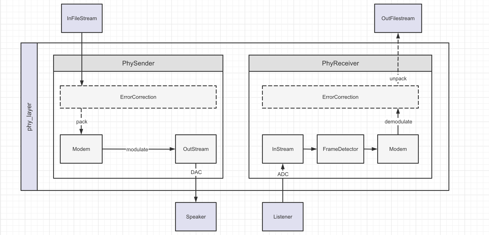

# CS120 Computer Network Report

In each project, we will explain our project part by part. Each part includes: `Structure` and `Algorithm`, `Tests` and `Acknowledgement`. For convenience, we will have a seperate `Tests` and `Acknowledgement` section at the end of each project. You can build the code documentation by the following command:

```shell
cargo doc --open
```

[TOC]

## Project 1: Acoustic Link

We have mainly four components:

- Block buffer: The queue-like structure for stream data. Both original version and concurrent version are defined in
  [block_buffer.rs](./proj1_acoustic_link/src/block_buffer.rs).
- Sample I/O Stream: The structures operate on sample streams. Sample streams are divided into instream and outstream. Instreams read samples from physics world and store the data in its buffer. Ostreams fetch samples to its buffer and write them to the physics world. The sample streams are in [samples_stream.rs](./proj1_acoustic_link/src/sample_stream.rs).
- Physics packet sender/receiver: Structures send or receive packet. Sender owns an sample instream and receiver owns an sample outstream. They are responsible for packet detection, modulation and demodulation. The sender and receiver are in [phy_packet.rs](./proj1_acoustic_link/src/phy_packet.rs)
- Physics layer: The assembled physics layer. Provide basic data transmission over acoustic link. There three types of links: PSK, OFDM and PSK with error correction. The physics layers are in [phy_layer.rs](./proj1_acoustic_link/src/phy_layer.rs).

The whole project structure lies below:


### Part 1 Understand your tools

In this part, we implement

- `buffer` and `concurrent_buffer`: Basic block data structure
- `cpal_stream`: Audio I/O stream
- `hound_stream`: wav file I/O stream

#### Structure

#### Algorithm

#### Tests

#### Acknowledgement

### Part 2

### Part 3

### Part 4

### Part 5

### Part 6

### Tests

### Acknowledgement
